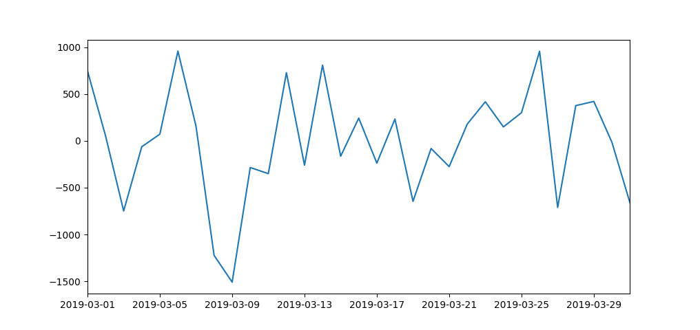
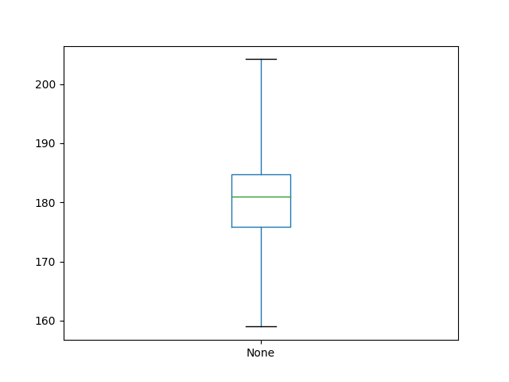
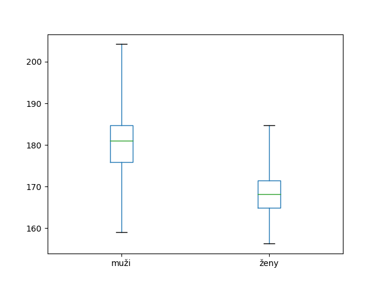

V této lekci si ukážeme, jak zobrazovat různé druhy grafů pomocí modulu `matplotlib`. Také si představíme Jupyter notebook, díky kterému budeme schopni vytvářet hezké reporty z našich datových analýz.

## První graf

Modul `matplotlib` nabízí ohromné množství možností pro vizualizaci dat. My zde probereme jen naprosté základy, aby nám lekce nenarostla to olbřímích rozměrů.

Pokud chceme v Pythonu používat modul `matplotlib`, je potřeba jej již tradičním způsobem nainstalovat

```shell
pip3 install matplotlib
```

Popř. pod Windows

```shell
pip install matplotlib
```

Nyní můžeme otevřít Python konzoli a náš zbrusu nový modul naimportovat.

```pycon
>>> import matplotlib.pyplot as plt
```

Pokud vše proběhlo jak má, můžeme vyzkoušet zobrazit naše první data. Budou to pohyby na bankovním účtu za měsíc březen 2019.

```pycon
>>> pohyby = [746, 52, -749, -63, 71, 958, 157, -1223, -1509, -285, -350, 728, -260, 809, -164, 243, -238, 233, -646, -82, -275, 179, 417, 149, 301, 957, -711, 376, 421, -15, -663]
```

Z těchto dat si vyrobíme Pandas sérii. Abychom byli co nejpoctivější, vyrobíme si index naší série jako objekty typu `date`

```pycon
>>> import pandas
>>> import datetime as dt
>>> datumy = [dt.date(2019, 3, d) for d in range(1, 32)]
>>> ucet = pandas.Series(pohyby, index=datumy)
```

Nyní vyzkoušíme zobrazit přírůstky jako graf. Stačí napsat

```pycon
>>> ucet.plot()
>>> plt.show()
```



Užitečnější by mohlo být zobrazit například graf zůstatků

```pycon
>>> ucet.cumsum().plot()
>>> plt.show()
```


Nyní si s grafem můžeme vyhrát podle chuti a nastavit jeho vzezření přesně tak, jak potřebujeme. Metoda `plot` na sériích obsahuje nepřeberné možnosti nastavení. Například takto vyrobíme z pohybů na účtu sloupcový graf s mřížkou ve žluté barvě.

```pycon
>>> ucet.plot(kind='bar', color='yellow', grid=True)
>>> plt.show()
```


Protože možností a parametrů je opravdu hodně, vyplatí se číst [oficiální dokumentaci](https://pandas.pydata.org/pandas-docs/stable/reference/api/pandas.Series.plot.html) a projít si nějaký vhodný tutoriál na internetu například přímo [ten oficiální](https://pandas.pydata.org/pandas-docs/stable/user_guide/visualization.html) k vizualizaci v Pandas.

## Typy grafů

Typ grafu, který chceme zobrazit, se v metodě `plot` specifikuje pomocí argumentu `type`. Sloupcový graf pohybů na účtu

Základní typy grafů, které se hojně používají mohou být například tyto:


- `plot()` - [Bodový graf](https://matplotlib.org/api/_as_gen/matplotlib.pyplot.plot.html)
- `bar()` - [Sloupcový graf](https://matplotlib.org/api/_as_gen/matplotlib.pyplot.bar.html)
- `hist()` - [Histogram](https://matplotlib.org/api/_as_gen/matplotlib.pyplot.hist.html)
- `boxplot()` - [Krabicový graf](https://matplotlib.org/api/_as_gen/matplotlib.pyplot.boxplot.html)

## Histogramy

Histogram je důležitý typ grafu, který nám umožňuje zobrazit četnost hodnot z nějakého datasetu. Následující seznam obsahuje výšku 64 náhodných mužů v České republice, měřeno v centimetrech.

```pycon
>>> muzi = pandas.Series([
  179.3, 183.7, 181.4, 176.0, 183.6, 184.7, 163.4, 180.3,
  167.5, 166.8, 173.5, 172.5, 173.0, 177.6, 176.0, 179.5,
  182.6, 172.0, 183.2, 177.0, 176.2, 175.7, 174.3, 180.3,
  184.9, 171.1, 182.3, 169.7, 181.3, 188.8, 176.8, 159.0,
  180.3, 198.5, 185.8, 191.0, 170.9, 196.0, 183.3, 183.0,
  189.9, 184.8, 184.0, 183.1, 184.0, 190.7, 191.7, 187.8,
  177.5, 177.5, 189.2, 188.4, 195.0, 204.2, 180.2, 181.3,
  178.2, 182.6, 172.1, 175.7, 180.7, 181.2, 165.0, 188.6
])
```

Pomocí histogramu zobrazíme četnosti jednotlivých hodnot.

```pycon
>>> muzi.hist()
>>> plt.show()
```


Histogram si pro přehlednost můžeme rozdělit do <term cs="přihrádek" en="bins"> po pěti centimetrech

```pycon
>>> muzi.hist(bins=[
  150, 155, 160, 165, 170, 175, 180, 185, 190, 195, 200, 205, 210
])
>>> plt.show()
```


## Krabicový graf

Krabicový graf graficky znázorňuje medián a kvartily naměřených hodnot. Můžeme si jej vyzkoušet na výškách mužů.

```pycon
>>> muzi.plot(kind='box', whis=[0, 100])
>>> plt.show()
```



Krabicové grafy jsou užitečné především pro porovnání dvou různých měření. Přidejme si druhou datovou sadu představující naměřené výšky žen

```pycon
>>> zeny = pandas.Series([
  172.0, 169.0, 166.8, 164.6, 172.7, 171.5, 167.0, 167.0,
  168.3, 184.7, 166.0, 160.0, 168.8, 165.8, 173.5, 163.0,
  168.9, 158.4, 166.4, 169.4, 174.2, 175.6, 167.2, 168.0,
  171.5, 168.8, 168.9, 174.1, 169.0, 170.7, 156.3, 174.8,
  169.1, 161.4, 172.5, 166.1, 171.5, 163.9, 164.5, 169.0,
  168.5, 163.3, 169.5, 167.4, 175.5, 165.0, 166.6, 158.9,
  164.5, 168.7, 161.6, 175.8, 179.0, 167.9, 161.1, 167.6,
  165.9, 165.2, 176.0, 179.4, 160.1, 163.8, 177.7, 160.4
])
```

Nyní chceme zobrazit krabicový graf porovnávající výšky obou pohlaví. K tomu si z našich sérií vyrobíme DataFrame.

```pycon
>>> vysky = muzi.to_frame(name='muži')
>>> vysky['ženy'] = zeny
>>> vysky.plot(kind='box', whis=[0, 100])
>>> plt.show()
```



[[[ excs Cvičení
- hazeni-kostkami
- call-centrum
- hura-na-hory
]]]

## Jupyter Notebook

Na úplný závěr našeho kurzu se naučíme pracovat s Jupyter notebookem. Je to webové prostředí, ve kterém můžete vytvářet hezky učesané reporty z vašich datových analýz. Jupyter musíme nejprve nainstalovat.

```shell
pip3 install jupyter
```

Pod Windows jako obvykle stačí

```shell
pip install jupyter
```

Nyní si někde na disku vytvoříme složku, ve které budeme skladovat naše Jupyter notebooky. V terminálu se přesuneme do této složky a napíšeme

```shell
jupyter notebook
```

