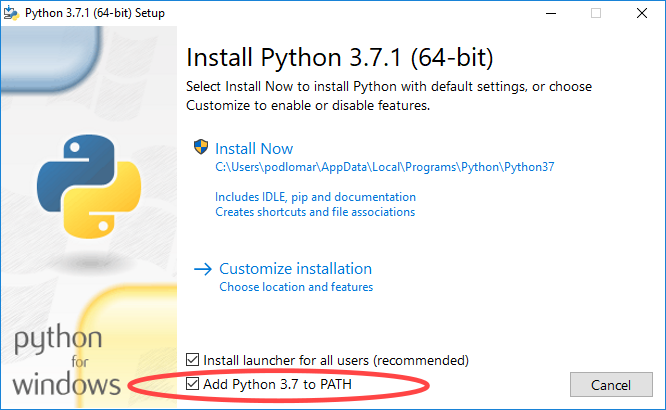
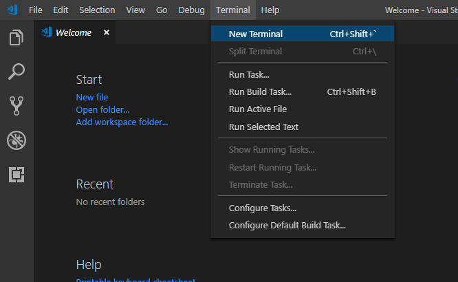

Než se pustíme do samotného programování, je potřeba na váš počítač nainstalovat dva nové programy, které budeme k programování potřebovat. Předtím si však ještě povíme něco o tom jak se svým počítačem komunikovat.

## Operační systém

Každý počítač potřebuje takzvaný operační systém, například Windows 10. Operační systém je v podstatě jeden velký program, který spravuje váš počítač, umožňuje vám jej ovládat, spouštět programy, pracovat se soubory na disku apod. Bez operačního systému by váš počítač byl jen černá obrazovka bez života, něco jako autobus bez řidiče.

Hned takto z kraje se nám ovšem věci začínají malinko komplikovat tím, že neexistuje pouze jeden operační systém, který by všichni svorně používali. Máme minimálně tři různé možnosti, Windows, Mac OS a Linux. Běžní lidé na ulici používají Windows, hipstři a hipsterky v kavárnách používají Mac OS a vousatí geekové v kostkovaných košilích používají různé varianty Linuxu.

Nejrozšířenější je v dnešní době systém Windows od Microsoftu. Ten používá většina lidí v práci i na osobních počítačích. Mac OS je operační systém dodávaný s počítači od firmy Apple. Nejpopulárnější je v USA ale u nás se také hojně používá. Linux naopak vzešel z akademického prostředí a vyvíjejí jej lidé, kteří věří ve svobodné nakládání se softwarem. Většinou jej používají nadšenci, kteří si rádi hrají s počítači a chtějí mít věci pod kontrolou. Linux se však snaží přiblížit také běžným uživatelům a vznikají proto distribuce jako Ubuntu, Linux Mint apod. které jsou na ovládání velmi podobné Windows a Mac OS.

## Instalace nástrojů

Abychom mohli začít programovat, je potřeba na počítač nainstalovat dva programy - samotný jazyk Python a Visual Studio Code. Postup se liší podle toho, jaký máte operační systém. Instrukce pro každý systém zvlášť naleznete níže.

### Windows

Pokud máte počítač s Windows, následujte tyto kroky:

1. Ujistěte se, že máte aktualizovaný systém. To zajistíte nejjednodušeji tak, že svůj počítač restartujete. Pokud jste již dlouho neaktualizovali, při restartu se může spustit aktualizace, která může trvat relativně dlouho, v extrémním případě třeba i hodinu. Nenechte se vyděsit, obrňte se trpělivostí a vyčkejte, dokud Windows opět nenaběhnou.
1. Jděte na stránku [Python Releases for Windows](https://www.python.org/downloads/windows/), kde klikněte na **Latest Python 3 Release** a dole stáhněte **Windows installer (64-bit)**. Stažený soubor spusťte. Rozeběhne se průvodce instalací.
1. Na úvodní obrazovce je **velmi důležité** zaškrtnout volbu **Add Python 3.x to PATH** (viz obrázek)
   {.fig .fig-100}
1. Klikněte na **Install Now** , odsouhlaste případné otázky ohledně změn na vašem počítači a vyčkejte dokončení instalace. Jakmile instalace skončí, zavřete okno tlačítkem **Close**.
1. Z [tohoto odkazu](https://aka.ms/win32-x64-user-stable) si stáhněte Visual Studio Code.
1. Stažený soubor spusťte. Rozeběhne se průvodce instalací, ve kterém stačí klikat na **Next** tak dlouho, dokud se nespustí instalace. Ve druhém kroku je pouze potřeba souhlasit s licencí.
1. Jakmile instalace doběhne, zavřete okno tlačítkem **Finish**. Visual Studio Code by se mělo samo spustit ihned po instalaci.

### Mac OS

Pokud máte počítač se systémem Mac OS, následujte tyto kroky.

1. Jděte na stránku [Python Releases for Mac OS X](https://www.python.org/downloads/mac-osx/), kde klikněte na **Latest Python 3 Release** a stáhněte **macOS 64-bit installer**.
1. Stažený soubor spusťte a pokračujte dle pokynů instalace až do jejího konce.
1. Z [tohoto odkazu](https://go.microsoft.com/fwlink/?LinkID=620882) si stáhněte Visual Studio Code. Spusťte instalaci a opět ji následujte až do zdařilého konce.

### Linux

Pokud používáte některou z populárních distribucí Linuxu jako Ubuntu, Linux Mint apod., je velká naděje, že už máte python nainstalovaný. Napište do příkazové řádky příkaz `python3`.

**POZOR!** Symbol dolaru na začátku příkazu se do terminálu nepíše. Slouží pouze k tomu, abychom odlišili, že příkaz se píše do terminálu a ne někam jinam.

```shell
$ python3
```

A sledujte, zda se objeví zpráva podobná této

```
Python 3.6.6 (default, Sep 12 2018, 18:26:19)
[GCC 8.0.1 20180414 (experimental) [trunk revision 259383]] on linux
Type "help", "copyright", "credits" or "license" for more information.
```

Pokud je verze Pythonu na prvním řádku alespoň 3.5, jste připravení.

## Ověření instalace

Nejprve ověřme, že instalace nástrojů proběhla v pořádku. Ať už jste na jakémkoliv operačním systému, spusťte vaše nově nainstalované Visual Studio Code a z horní lišty vyberte <i>Terminal</i> → <i>New Terminal</i> (viz obrázek).

{.fig .fig-100}

**POZOR!** Symbol dolaru na začátku příkazu se do terminálu nepíše. Slouží pouze k tomu, abychom odlišili, že příkaz se píše do terminálu a ne někam jinam.

Pokud jste na Windows, napište do okna terminálu příkaz `py`:

```shell
$ py
```

a stiskněte Enter. Stejně by měl fungovat i příkaz `python`.

Pokud jste na Macu nebo Linuxu, je třeba napsat

```shell
$ python3
```

Pokud je vše v pořádku, měly by se po pár krypticky vypadajících výpisech ukázat tři zobáčky `>>>` a kurzor. To znamená, že Python je připraven na vaše první příkazy.
